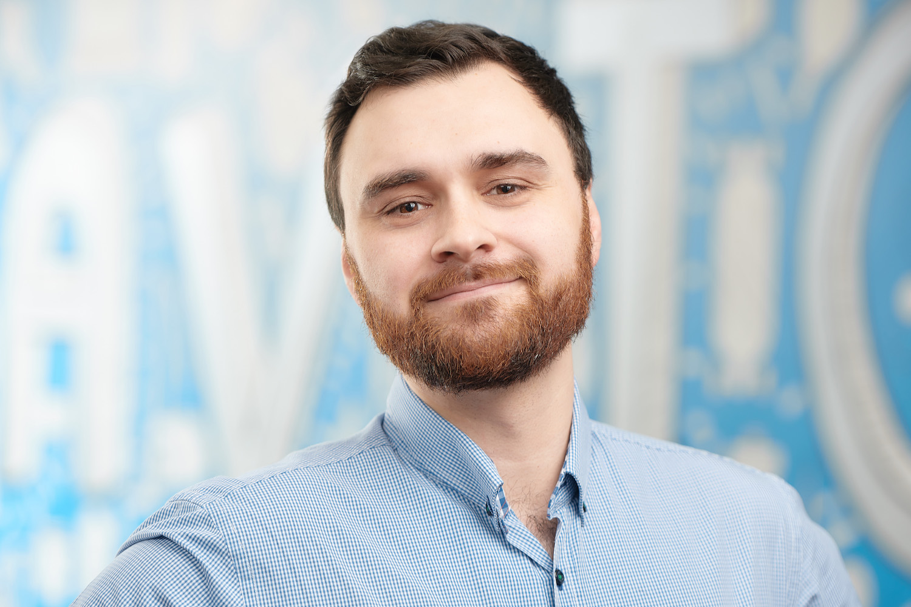

# Дмитрий Кунин

### Тимлид разработчиков клиентской части
 - +79057801950 
 - [info@dkun.in](mailto:info@dkun.in)
 - [dkun.in](dkun.in)

### О себе

Экономическое образование неожиданно привело меня в разработку сайтов и приложений, так бывает, на то она и жизнь, чтобы быть непредсказуемой. В жизни и в работе я стараюсь придерживаться идей и философии стоиков и минималистов. 

Будучи крайне ленивым постоянно стараюсь оптимизировать рутинные задачи, во всех сферах жизни. Будь то написание скрипта для формирования мердж коммита или разработка приложения для быстрого составления списка покупок - я с удовольствием берусь за задачу, цель которой сократить минуты от рутинных задач - которые в перспективе позволят мне сэкономить часы и дни, которые можно уделить семье и/или другим проектам. 

### Чем занимаюсь в Avito

В авито с 2015-ого года. Занимался различными задачми, в том числе учавствовал в разработке внутреннего Helpdesk, который, кроме прочего, позволил сократить время первого ответа поддержки пользователей с нескольих дней - до нескольких часов. На данный момент является техническим лидером команды Trust&Safety, проекты которой включают в себя Авторизацию/Регистрацию/Восстановление доступа к сервису, рейтинги, отзывы, избранные продавцы, публичный профиль, аватары, в общем и целом - все что касается сущности пользователя на площадке.

## Технические навыки

- HTML, CSS, JavaScript (ES5/ES6), CSS-preprocessors, HTML-preprocessors
- React.js, Vue.js
- Node.js, express, gulp, wepback
- Git
- GoLang, начинающий

## Профессиональные цели

Улучшение UX приложений и проектов над которыми работаю. Разработка приложений, решений и программ на пользу пользователей.

### Какими знаниями и навыками готов делиться

- Личная эффективность
- Внутренняя мотивация
- Организация жизни
- Быть счастливее имея меньше

### Выступления

- MoscowJS Meetup 06.09.2013 [Видео](http://youtu.be/_SWVDpHe7yg)
- MoscowJS Meetup 26.03.2015 [Видео](http://www.youtube.com/watch?v=7LW740IQzEo)
- Lint yourself Frontend Conf 2018 [Видео](https://www.youtube.com/watch?v=O0CIg09F9HE)
- Dat протокол — общие понятия, инструменты, применение  [Видео](https://www.youtube.com/watch?v=ON07SLfox9I)