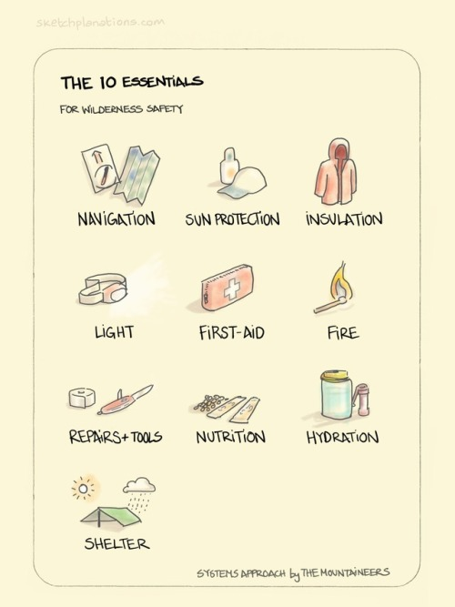

# Misc Survival links

- [Clay pot cooler](https://en.wikipedia.org/wiki/Pot-in-pot_refrigerator)
- 

Survival Pack:

1. Горелка с подставкой для сухого горючего
2. Набор пластиковой посуды
3. Котелок армейский
4. ИРП - 2 шт (индивидуальный рацион питания)
5. Хлорэксель - 4 шт (таблетки для очистки воды)
6. Нож фиксированный
7. Мультитул (многофункциональный инструмент)
8. Стеклобой (для экстренного покидания заблокированного автомобиля)
9. Складная лопата
10. НАЗ (свисток, компас, нож, огниво, спички, и т. д. – 16 компонентов)
11. Фальшфейер (сигнальный факел)
12. Налобный фонарь
13. Фонарик
14. ХИС - 3 шт (химический источник света)
15. АИТ - 2 шт (автономный источник тепла)
16. Тент
17. Паракорд - 15 м (верёвка)
18. Карабины - 2 шт 
19. Термоодеяло
20. Набор гигиенический
21. Блокнот влагозащитный
22. Респиратор
23. Перчатки кожаные комбинированные
24. Скотч армированный
25. Гермоупаковка (для документов)
26. Плащ-дождевик
27. Аптечка (сумка)
28. Органайзер (сумка)
29. Рюкзак
30. Памятка "Оказание первой помощи пострадавшим"
31. Советы по выживанию

